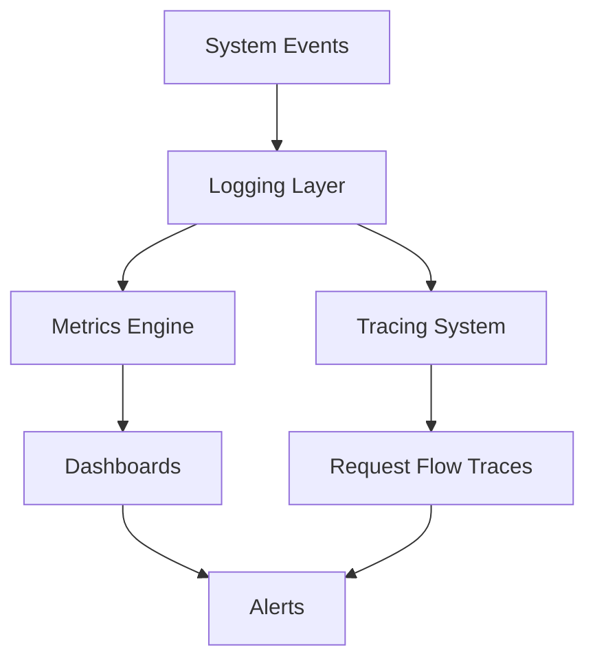

# Observability — Scheduling System

## 🧠 Purpose

Observability ensures visibility into workflow execution, scheduling decisions, and system behavior under load.

---



---

## 📊 Logging Layers

### 1. Request Logs
- Incoming scheduling requests
- User/resource metadata

### 2. Decision Logs
- Why a booking was accepted or rejected
- Conflict detection results

### 3. System Logs
- Workflow execution steps
- Orchestration events

---

## 📈 Metrics

- Booking success rate
- Conflict frequency
- Average scheduling latency
- Resource utilization rate

---

## 🚨 Monitoring Signals

- High conflict detection rate → rule misconfiguration
- Scheduling delays → performance bottleneck
- Failed workflow executions → orchestration issue

---

## 🧠 Debugging Model

Every booking must be traceable through:

```
Request → Validation → Decision → Outcome
```
