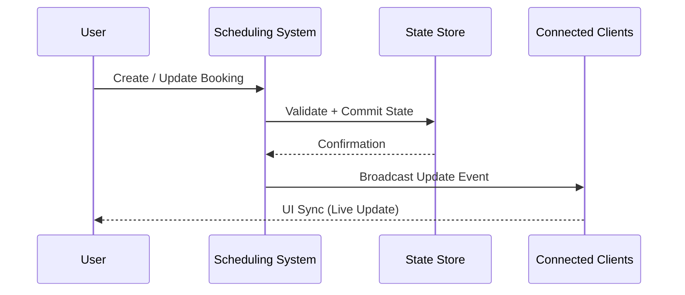

# Real-Time System Design

## 🧠 Purpose

Defines how scheduling updates propagate across users and maintain consistency in a multi-user environment.

---

## 🔄 Real-Time Flow

---

## ⚙️ Real-Time Behaviors

- Instant schedule updates
- Live conflict feedback
- Shared calendar synchronization
- Multi-user visibility of resource state

---

## 🧩 Consistency Model

- Single source of truth for scheduling state
- Event-driven updates across clients
- Eventually consistent UI synchronization (acceptable delay under load)

---

## 🚀 Design Goal

Ensure all users see consistent resource availability without manual refresh or desynchronization.
