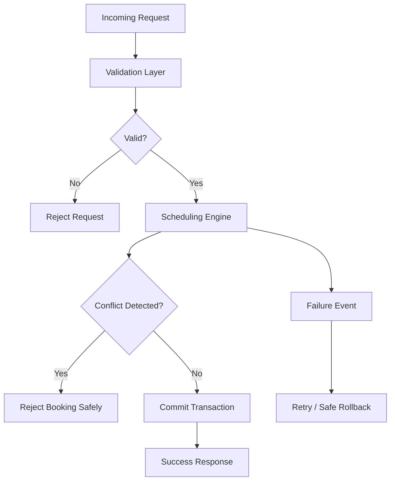

# Reliability — Scheduling System

## 🧠 Purpose

Ensures system continues to operate correctly under failure conditions, concurrency, and high load.

---

---

## ⚙️ Failure Handling

- Retry failed scheduling operations
- Graceful rejection of invalid requests
- Safe rollback on partial workflow failure

---

## 🔒 Concurrency Safety

- Prevent double-booking through locking mechanisms
- Serialize critical scheduling operations
- Ensure atomic booking decisions

---

## 🧠 Fault Tolerance Strategy

- Fail-fast validation layer
- Safe degradation under high load
- No partial state commits in scheduling decisions

---

## 🎯 Reliability Goal

A booking must be either:

- Fully committed  
OR  
- Fully rejected  

No intermediate states allowed.
